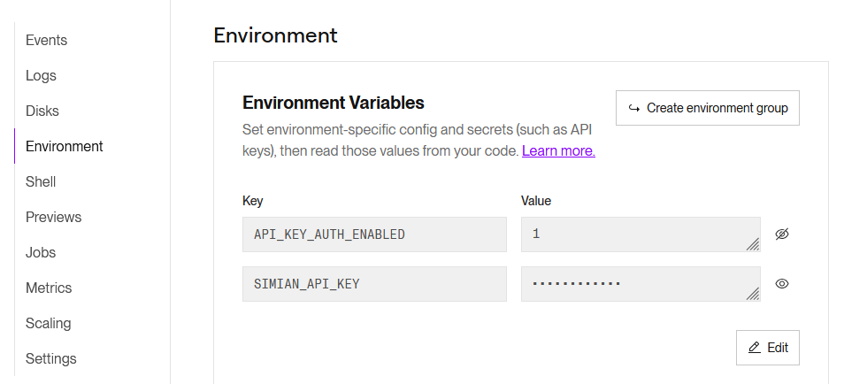

# Deploy your Python Simian Web App on Render

Deployment of a Simian Web App involves 4 main steps:
1. Get the code (this repo)
2. Deploy your Simian Web App Python code as a web service on a(ny) backend.  
   [Render](https://render.com) offers _**convenient & free**_ hosting Python code as a web service, _**directly from GitHub**_.   
   This GitHub project automates deployment of Python based Simian Web Apps on Render.
   Setting up deployment from GitHub to Render can be done with the push of a button.  
   Updates to your code pushed to GitHub will be automatically deployed to your onrender.com web service.  
   > This way Simian Web App functionality is exposed as a web service.  
   > Source code is under your control and not shared with simiansuite.com.
3. Publish the app on Simian Portal  
   For evaluation purposes, a shared Simian Evaluation Portal where you can configure your own Simian Web App is readily available.  
4. Use your app, live on the web

# Repository contents
- Render build information is provided in `render.yaml`.
- Python package installation instructions are provided through `requirements.txt`.
- FastAPI routing and generation of Simian specific startup information in logs is done in `main.py`.
- Simian Web Apps are placed in the `apps` folder.

## "Hello World!" app included
A basic Simian Web App `hello-world.py` example is included in this repository in the `apps` directory.  
The endpoint to this is example is `https://YOUR_SUBDOMAIN.onrender.com/hello-world`

## Add your own app(s)
Additional Simian Web App(s) by adding your Simian Web App module to the `apps` directory.  

It is recommended to name your module in lower case chracters and underscores when needed.  
The route will be the base name of your module `.py` file with underscores (`_`) replaced by dashes (`-`).

The endpoint to a module called `my_first_simian_app.py` stored in the `apps` folder would be `https://YOUR_SUBDOMAIN.onrender.com/my-first-simian-app`

# Deploy to web service on Render
To get started you can deploy directly from this read-only GitHub repository to your own render.com web service.  Just click the "Deploy to Render" button below.

> If you are new to Render you will need to create an account.

Alternatively, you can fork this project on GitHub and deploy to render from there. Changes pushed to your GitHub repository will then automatically be deployed to your onrender.com web service.

> _**If you fork this repository (or use it as a template), you should modify the github project url in this `README.md` file in two locations to point to your GitHub repository:**_
> 1. "Manual steps" step 1
> 2. "Deploy to Render" button

## Click to deploy

[](https://render.com/deploy?repo=(https://github.com/Simian-Web-Apps/simian-deploy-render/))

## Optional: API Key
API key authentication (very basic, not for production usage) is configured by means of environment variables for the onrender.com web service:  
- To enable set `API_KEY_AUTH_ENABLED` to `1`.  
  When this variable does not exist, or is set to `0` api key authentication is disabled.
- If api key authentication is enabled, `SIMIAN_API_KEY` must be set to your API Key (lower case letters and numbers only).
  


## Render free plan & web service spin-down
The free individual offering from render.com does spin down web services after some period of inactivity (15 minutes at the time of writing).
When starting the Simian Web App after such period of inactivity it needs to be spinned up causing a delay of 1 minute or more. 

Consider upgrading to a paid render.com plan to avoid spinning down.

Alternatively you could schedule a (cron) job that visits (GET) the root of your webservice every 10 minutes or so.  
For example, with connect-time sufficiently large to allow for spin-up:  

With Authentication:  
```
curl --connect-timeout 300 --header "Simian-Api-Key:YOUR_API_KEY" https://YOUR_SUBDOMAIN.onrender.com/
```  

Without authentication:  
```
curl --connect-timeout 300 https://YOUR_SUBDOMAIN.onrender.com/
```  

## Manual deployment
See https://render.com/docs/deploy-fastapi or follow the steps below:

1. You may use this repository directly or [create your own repository from this template](https://github.com/Simian-Web-Apps/simian-deploy-render/generate) if you'd like to customize the code.
2. Create a new Web Service on Render.
3. Specify the URL to your new repository or this repository.
4. Render will automatically detect that you are deploying a Python service and use `pip` to download the dependencies.
5. Specify the following as the Start Command.

    ```shell
    uvicorn main:app --host 0.0.0.0 --port $PORT
    ```

6. Click Create Web Service.

# Simian Evaluation Portal
Publishing your Simian Web App:
1. Sign up at [Simian Evaluation Portal](https://evaluate.simiansuite.com/).  
   (On the evaluation portal your app will only be accessible to you.)   
1. From your Render deployment, take note of:  
   The _subdomain_ of your backend deployment under _.onrender.com_  
   The _API Key_ (if enabled on the onrender.com web service)  
1. In [Simian Evaluation Portal](https://evaluate.simiansuite.com/), configure and publish app [here](https://evaluate.simiansuite.com/configure_my_app/).  
   To configure the included `hello_world.py` app, set:
   - `Subdomain` to the subdomain of your `onrender.com web` service.  
     (Subdomain is `abc` if your webservice runs on `abc.onrender.com`.)
   - `Route` to the route to the module under the `apps` directory that you want to deploy: `hello-world` for `hello_world.py`.
     (Route to module is module file name without `.py`, and with `_` replaced by `-`.)
   - Optionally, when API Key authentication is enabled on the onrender webservice, `API Key` to the same value configured in the `SIMIAN_API_KEY` environment varible on the onrender.com web service.
1. Start your app via [Simian Evaluation Portal](https://evaluate.simiansuite.com/).  
   (If you want to bookmark the app for direct access, make sure the bookmark does not contain the `?tab_uuid=...` because that `tab_uuid` identifies a specific instance of the app which is no longer valid after closing the app.)


> Simian Portal supports app sharing and access management, but app access on [Simian Evaluation Portal](https://evaluate.simiansuite.com/) is restricted to yourself only and solely serves evaluation purposes.  
> Contact [simiansuite.com](https://simiansuite.com/contact-us/) for Simian Portal cloud, and on-premises options.

> Simian Portal works with a range of backend platforms from docker to Azure, and other cloud providers.
> For evaluation purposes render.com has been chosen because of its convenient deployment path from code on GitHub to a live FastAPI web service, its free entry offering and paid upgrade path, and last but not least because your code remains under your control.

# Thanks
Gratefully forked from [Render Examples - FastAPI](https://github.com/render-examples/fastapi) who thanks [Harish](https://harishgarg.com) for the [inspiration to create a FastAPI quickstart for Render](https://twitter.com/harishkgarg/status/1435084018677010434) and for some sample code!
